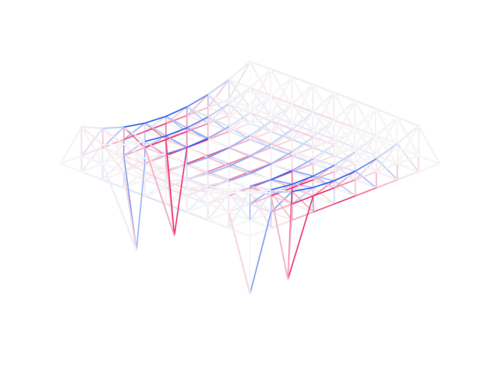

# Structural Model Database

This is a repository of .JSON files representing the topology and section properties of structural model geometries used throughout my PhD dissertation:

*Geometric interpretations of structural demand for the analysis and reduction of design complexity*

More structural examples will be added as my research progresses.

# `biosphere`
A structural model of the 1967 US Pavilion (AKA the Biosphere), Buckminster Fuller + hoji Sadao. 
Used in dissertation.
Modelled as a truss.

# `supersam`
A structural model of Waclaw Zalewski's Supersam roof structure with a conventional Pratt truss alternative.
Used in dissertation.
Modelled as trusses.

# `nervi`
An approximated structural model of the Palazzetto dello Sport by Pier Luigi Nervi.
The topology was generated by student Xinyang (Alan) Chen for his class project in 1.056 Introduction to Structural Design (Spring 2025).
Modelled as a frame with approximate section properties.

# `double-cantilever-truss`
A doubly-cantilevered planar Warren truss, both before and after minimum-volume optimization.
Used in dissertation.
Modelled as a truss.

# `double-cantilever-spaceframe`
A spaceframe structure supported on two edges, both before and after minimum-volume optimization.
Used in dissertation.
Modelled as a truss.

# `strange-frame`
A freeform frame structure with and without spine supports.
Used in dissertation.
Modelled as a frame.

# `multimat-bridge`
A steel/timber hybrid bridge structure.
Initial configuration + 64 combinations of steel/timber across 6 different element groups.
Used in dissertation.
Modelled as trusses.

# `salginatobel`
An approximate model of the scaffolding truss structure constructed by Richard Coray for Robert Maillart's Salginatobel Bridge.
Used in dissertation.
Modelled as a truss.

# `renaud-trusses`
A sample of 100 "Renaud Trusses", generated by Renaud Danhaive for his PhD work, used in my dissertation for the analysis of node demand similarity.
Used in dissertation.
Modelled as a truss.

# `printed-bridge`
A model of a 3D printed bridge structure, provided by Yijiang Huang, from Tam et al. 2018 "Fabrication-aware structural optimisation of lattice additive-manufactured with robot-arm".
Used in dissertation.
Modelled as a truss.

# `transmission-towers`
Three planar structural models of transmission towers.
Used in dissertation.
Modelled as a truss.

